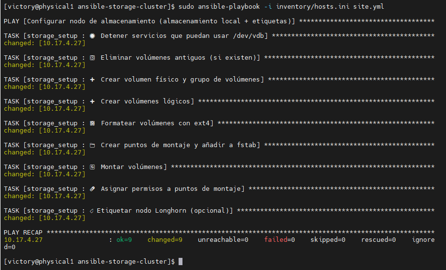

# 📦 Ansible Storage Cluster – FlatcarMicroCloud

Este proyecto automatiza la configuración de un nodo de almacenamiento (`storage1`) usando **Ansible**, optimizado para **Flatcar Linux** (sin Python) y clústeres Kubernetes con **K3s**. Forma parte del ecosistema [FlatcarMicroCloud](https://github.com/vhgalvez/FlatcarMicroCloud).

---

## ✨ Visión General

El nodo `storage1` ofrece almacenamiento persistente y distribuido de alta disponibilidad para:

- Bases de datos como **PostgreSQL**
- Datos compartidos entre pods (**RWX**)
- Volúmenes gestionados por **Longhorn (RWO)**

Utiliza **LVM**, **NFS** y almacenamiento local en `/dev/vdb`.

---

## 📚 Tabla de Roles y Almacenamiento por Nodo

| Nodo        | Disco                 | Rol en Longhorn                    | Observaciones                            |
|-------------|-----------------------|------------------------------------|------------------------------------------|
| `storage1`  | `/mnt/longhorn-disk`  | Nodo **dedicado** de almacenamiento | ✅ Ideal: marcar como `Not Schedulable` |
| `worker1`   | Disco local de 50 GB   | Nodo mixto (cálculo + almacenamiento) | ✅ Recomendado                         |
| `worker2`   | Disco local de 50 GB   | Nodo mixto                          | ✅                                       |
| `worker3`   | Disco local de 50 GB   | Nodo mixto                          | ✅                                       |

> ⚠️ Se recomienda marcar `storage1` como **Not Schedulable** en Longhorn para evitar ejecutar pods ahí.

---

## 📁 Directorios Montados en `storage1`

| Ruta                    | Propósito                                  | Tipo de Acceso     |
|-------------------------|--------------------------------------------|--------------------|
| `/srv/nfs/postgresql`   | Volumen persistente para PostgreSQL vía NFS | RW (Read/Write)    |
| `/srv/nfs/shared`       | Volumen compartido para pods                | RWX (ReadWriteMany)|
| `/mnt/longhorn-disk`    | Disco para almacenamiento Longhorn          | RWO (ReadWriteOnce)|

---

## 🔧 Tecnologías Usadas

- **LVM**: Para crear volúmenes lógicos escalables sobre `/dev/vdb`
- **NFS Server**: Exporta volúmenes accesibles por otros nodos
- **Longhorn**: Almacenamiento distribuido para Kubernetes

---

## ⚙️ Requisitos Previos

- Nodo o VM con **Flatcar Linux**
- Disco adicional (`/dev/vdb`) de **80 GB**
- Acceso SSH con clave en `inventory/hosts.ini`
- Ansible 2.14+ instalado en el nodo controlador

---

## 📂 Estructura del Proyecto

```bash
flatcar-k3s-storage-suite/
├── inventory/
│   ├── hosts.ini
│
├── playbooks/
│   ├── site.yml                        # Orquestador principal
│   ├── playbook_cleanup.yml           # Limpieza total del almacenamiento
│   ├── longhorn_worker_disk_setup.yml        # ⬅️ Nuevo: Setup Longhorn en workers
│   ├── label_longhorn_nodes_from_master.yml  # ⬅️ Nuevo: Etiquetado desde master1
│   └── nfs_config.yml                 # Configuración de exportaciones NFS
│
├── roles/
│   ├── storage_setup/
│   │   └── tasks/
│   │       └── main.yml               # Setup LVM + NFS en nodo storage
│   │
│   ├── longhorn_worker/
│   │   └── tasks/
│   │       └── main.yml               # Lógica de disco + etiquetas para Longhorn
│   │
│   └── nfs_config/
│       └── tasks/
│           └── main.yml               # Exporta rutas NFS
│
└── README.md

```

---

## 🚀 Ejecución

### 1️⃣ Configurar almacenamiento (`/dev/vdb`)

```bash
sudo ansible-playbook -i inventory/hosts.ini site.yml
```

### 2️⃣ Limpiar configuración previa (si es necesario)

```bash
sudo ansible-playbook -i inventory/hosts.ini playbook_cleanup.yml
```

---

## 📸 Ansible OK



---

## 🧪 Verificación

```bash
df -h
sudo exportfs -v
systemctl status nfs-server
```

### Montar NFS desde otro nodo

```bash
sudo mount -t nfs storage1.cefaslocalserver.com:/srv/nfs/postgresql /mnt
```

---

## 🏷️ Etiquetar y proteger el nodo `storage1` para Longhorn

Para una gestión más clara de los nodos que participan en el almacenamiento con **Longhorn**, es recomendable:

- Etiquetar el nodo con una clave personalizada.
- Marcarlo como **No Schedulable** para evitar que se usen para pods normales.

### 📌 Propósito

- Identificar `storage1` como nodo dedicado a almacenamiento.
- Aplicar políticas `nodeSelector` o `affinity`.
- Separar roles de cómputo y almacenamiento.

### 🛠️ Comandos Manuales

```bash
kubectl label node storage1.cefaslocalserver.com longhorn-node=true --overwrite
kubectl taint nodes storage1.cefaslocalserver.com node-role.kubernetes.io/storage=true:NoSchedule
```

### 🔍 Verificación

```bash
kubectl get nodes --show-labels | grep storage1
kubectl describe node storage1.cefaslocalserver.com | grep Taints
```

Deberías ver:

```bash
longhorn-node=true
Taints: node-role.kubernetes.io/storage=true:NoSchedule
```

---

## 📦 Tabla de Almacenamiento por VM

| Nodo           | Rol                   | IP            | Disco OS | Disco Extra | Uso del Disco Extra                                         |
|----------------|------------------------|----------------|----------|-------------|-------------------------------------------------------------|
| master1        | Master Kubernetes      | 10.17.4.21     | 50 GB    | —           | —                                                           |
| master2        | Master Kubernetes      | 10.17.4.22     | 50 GB    | —           | —                                                           |
| master3        | Master Kubernetes      | 10.17.4.23     | 50 GB    | —           | —                                                           |
| worker1        | Worker + Longhorn      | 10.17.4.24     | 20 GB    | 40 GB       | Almacenamiento Longhorn (RWO)                               |
| worker2        | Worker + Longhorn      | 10.17.4.25     | 20 GB    | 40 GB       | Almacenamiento Longhorn (RWO)                               |
| worker3        | Worker + Longhorn      | 10.17.4.26     | 20 GB    | 40 GB       | Almacenamiento Longhorn (RWO)                               |
| storage1       | NFS + Longhorn Backup  | 10.17.4.27     | 10 GB    | 80 GB       | PostgreSQL, compartidos y respaldo de Longhorn              |
| postgresql1    | DB Externa (futura)    | —              | —        | —           | Montará `/srv/nfs/postgresql` vía NFS                       |

---

## ✍️ Autor

**vhgalvez** – [FlatcarMicroCloud en GitHub](https://github.com/vhgalvez/FlatcarMicroCloud)

## 🛡️ Licencia

MIT License — Libre para uso educativo y personal.
