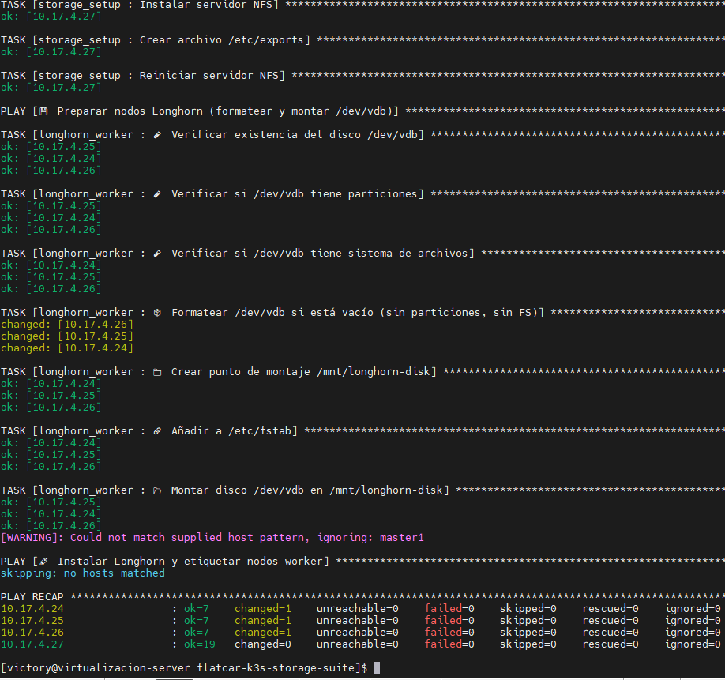
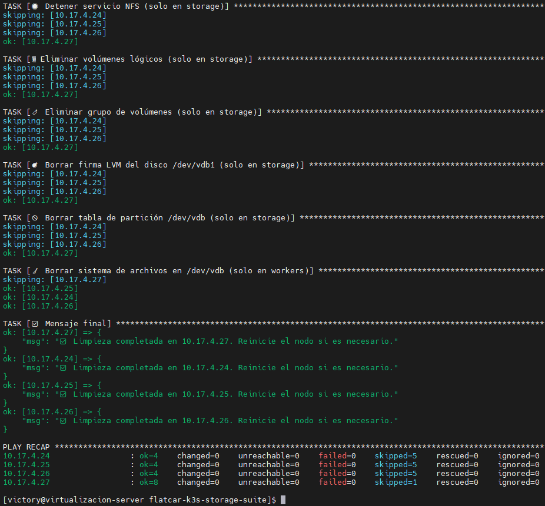
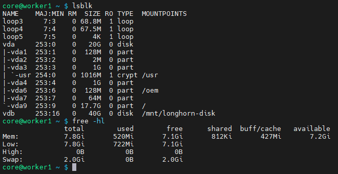
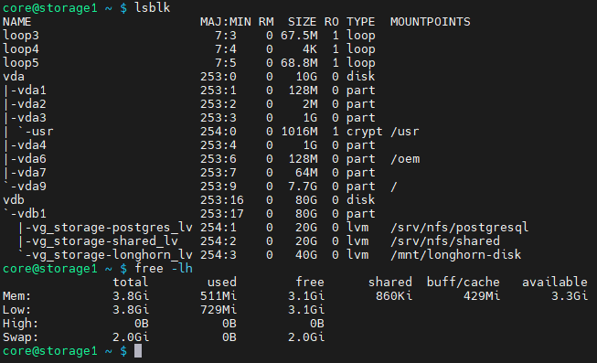
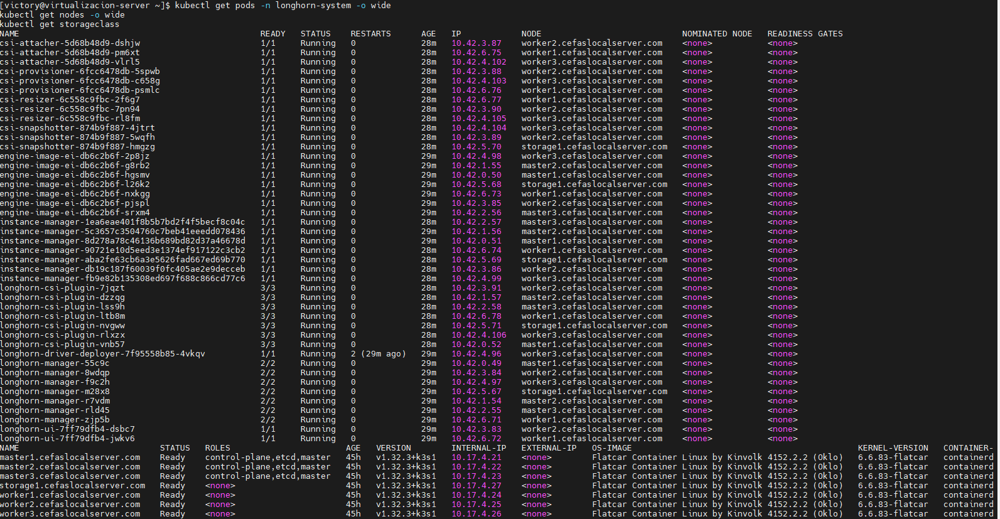
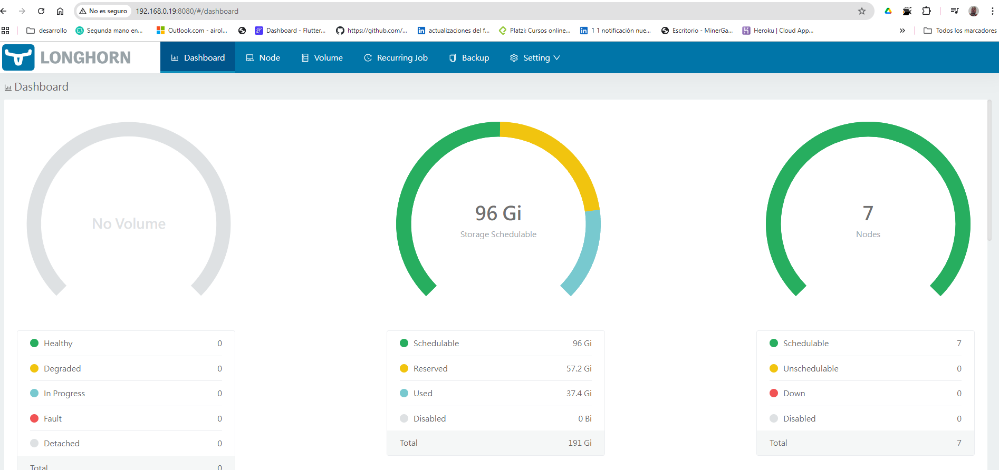

# 📦 flatcar-k3s-storage-suite - Guía de Uso Seguro

Este proyecto Ansible proporciona playbooks seguros para configurar almacenamiento persistente en un clúster Kubernetes sobre **Flatcar Linux y Rocky Linux**, utilizando LVM, NFS y Longhorn. Las tareas han sido cuidadosamente reforzadas para evitar operaciones destructivas accidentales y garantizar una ejecución segura.

> ⚠️ **ADVERTENCIA**: Lea completamente esta guía antes de ejecutar los playbooks. Las tareas de particionado y formateo pueden eliminar datos si se usan incorrectamente.

---

## ⚙️ Componentes Incluidos

- Configuración de volúmenes LVM para:
  - PostgreSQL (`/srv/nfs/postgresql`)
  - Datos compartidos (`/srv/nfs/shared`)
  - Longhorn (`/mnt/longhorn-disk`)
- Exportación NFS (automática).
- Preparación automática y segura de discos `/dev/vdb`.
- Playbook de limpieza con confirmación obligatoria.

---

## ⚠️ Recomendaciones de Seguridad

- **Inventario validado:** Revise `inventory/hosts.ini`. Asegúrese de que solo nodos con discos secundarios estén en los grupos `storage` o `longhorn_nodes`.
- **Evitar nodos críticos:** **NO incluya** en estos grupos a los nodos master ni al servidor de virtualización.
- **Discos secundarios solamente:** Solo se operará sobre `/dev/vdb`. **No se tocarán discos del sistema como `/dev/vda`, `/dev/sda`, `nvme0n1`, etc.**
- **Confirmación para limpieza:** El playbook de limpieza solo se ejecutará si pasa la variable `confirm_cleanup=yes`.

---

## ✅ Ejecución Segura - Paso a Paso

### 1. Configurar Acceso SSH
Configure acceso mediante clave SSH al usuario `core` desde el nodo de control hacia todos los nodos del clúster.

### 2. Verificar Inventario (`inventory/hosts.ini`)
Confirme que los nodos estén correctamente agrupados:
- **Grupo `storage`:** Nodos con volúmenes LVM y NFS (ej. `10.17.4.27`).
- **Grupo `workers`:** Nodos con disco para Longhorn (ej. `10.17.4.24`, `10.17.4.25`, etc.).

### 3. Ejecutar Configuración de Almacenamiento
```bash
sudo ansible-playbook -i inventory/hosts.ini site.yml
```
Este playbook ejecuta:
- **Detección y validación de discos.**
- **Particionado y creación de LVM.**
- **Formateo y montaje.**
- **Instalación de NFS.**
- **Habilitación del servicio.**

### 4. Validar Configuración de Discos Montados
```bash
df -h
```
Verifique:
- `/srv/nfs/postgresql`
- `/srv/nfs/shared`
- `/mnt/longhorn-disk`

---

## 📘 Tareas y su Descripción

### 🧱 `storage_setup` (Rol)
- Verificación segura de `/dev/vdb`.
- Particionado y creación de VG + LVs.
- Montaje y formateo.
- Exportación NFS.

### 💾 `longhorn_worker` (Rol)
- Verificación segura de `/dev/vdb`.
- Formateo y montaje en `/mnt/longhorn-disk`.

### 🚀 `install_longhorn.yml`
- Etiquetado de nodos.
- Instalación de Longhorn.
- Espera readiness de pods.

### 🧹 `playbook_cleanup.yml`
- Confirmación obligatoria con `confirm_cleanup=yes`.
- Detiene NFS.
- Desmonta volúmenes.
- Borra LVM y particiones.
- Seguro para reprovisionar nodos.

---

## 🧩 Estado de Discos

| Nodo      | Disco SO (vda) | Uso Sistema | Disco Adicional (vdb) | Estado Disco |
|-----------|----------------|-------------|------------------------|--------------|
| worker1   | 20 GB          | ~2.5 GB     | 40 GB                  | Libre        |
| storage1  | 10 GB          | ~2.5 GB     | 80 GB                  | Libre        |

---

## 🧹 Limpieza del Almacenamiento en Nodos (Opcional)

Si necesitas **reiniciar desde cero** los discos de los nodos de almacenamiento (`storage`) o de los `workers` que usan `/dev/vdb` para Longhorn, puedes utilizar el siguiente playbook de limpieza:

### ▶️ Ejecución Real:
```bash
sudo ansible-playbook playbooks/cleanup_longhorn.yml -i inventory/hosts.ini -e "confirm_cleanup=yes"
```

### 🔍 Ejecución en Modo Verificación (No Realiza Cambios):
```bash
sudo ansible-playbook playbooks/cleanup_longhorn.yml -i inventory/hosts.ini --check -e "confirm_cleanup=yes"
```

> Este playbook **no se ejecutará** sin la confirmación explícita `confirm_cleanup=yes`.

### ✅ ¿Qué Hace Este Playbook?
- Desmonta los volúmenes en `/srv/nfs/*` y `/mnt/longhorn-disk`.
- Borra los volúmenes lógicos (LVM) y el grupo de volúmenes en el nodo `storage`.
- Limpia la partición y la firma LVM del disco `/dev/vdb1` en `storage`.
- Ejecuta `wipefs` sobre `/dev/vdb` en nodos `workers`.
- Detiene y deshabilita el servicio `nfs-server` en `storage`.

> ⚠️ **Este playbook no elimina máquinas virtuales ni destruye configuraciones fuera del disco `/dev/vdb`.**

---

## 📊 Ejemplo de Configuración














---

## 🚀 Despliegue de Longhorn

### Comandos Útiles

#### Verificar Pods de Longhorn
```bash
kubectl get pods -n longhorn-system -o wide
```

#### Verificar Nodos
```bash
kubectl get nodes -o wide
```

#### Verificar StorageClass
```bash
kubectl get storageclass
```

#### Port-Forward para Longhorn
```bash
sudo env "PATH=$PATH" KUBECONFIG=$HOME/.kube/config nohup kubectl port-forward -n longhorn-system svc/longhorn-frontend --address 0.0.0.0 8080:80 > ~/longhorn-frontend.log 2>&1 &
```

#### Verificar Recursos Desplegados
```bash
kubectl get all -n longhorn-system
```

#### Verificar Estado de Pods
```bash
kubectl get pods -n longhorn-system -o wide
```

#### Ver Eventos del Namespace
```bash
kubectl get events -n longhorn-system --sort-by='.metadata.creationTimestamp'
```

#### Ver Logs de un Pod Específico
```bash
kubectl logs -n longhorn-system <nombre-del-pod>
```

#### Esperar a que los Pods Estén Listos
```bash
kubectl wait --for=condition=Ready pod --all -n longhorn-system --timeout=300s
```

#### Verificar Port-Forwards Activos
```bash
ps aux | grep port-forward
```

#### Matar Port-Forwards Antiguos
```bash
sudo pkill -f "kubectl port-forward"
```

---

## 🛡️ Conclusión

Este conjunto de playbooks garantiza una configuración de almacenamiento automatizada y segura para su clúster Kubernetes con Flatcar. Gracias a las validaciones y protecciones incluidas, puede trabajar con confianza evitando daños accidentales al sistema operativo o pérdida de datos.

> **Repositorio del Proyecto:** [`flatcar-k3s-storage-suite`](https://github.com/vhgalvez/flatcar-k3s-storage-suite)
>
> Proyecto independiente para usarse como prerequisito en arquitecturas como [FlatcarMicroCloud](https://github.com/vhgalvez/FlatcarMicroCloud).

---

## 📜 Licencia

Este proyecto está licenciado bajo la **Licencia MIT**. Consulte el archivo [LICENSE](LICENSE) para más detalles.
